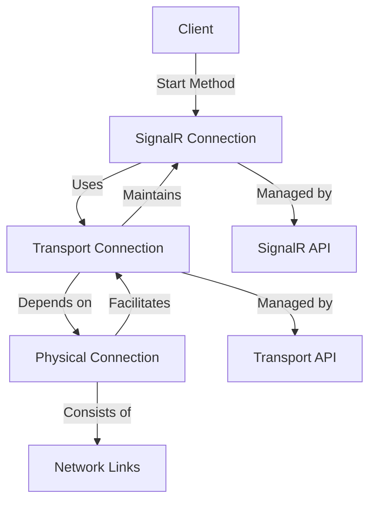
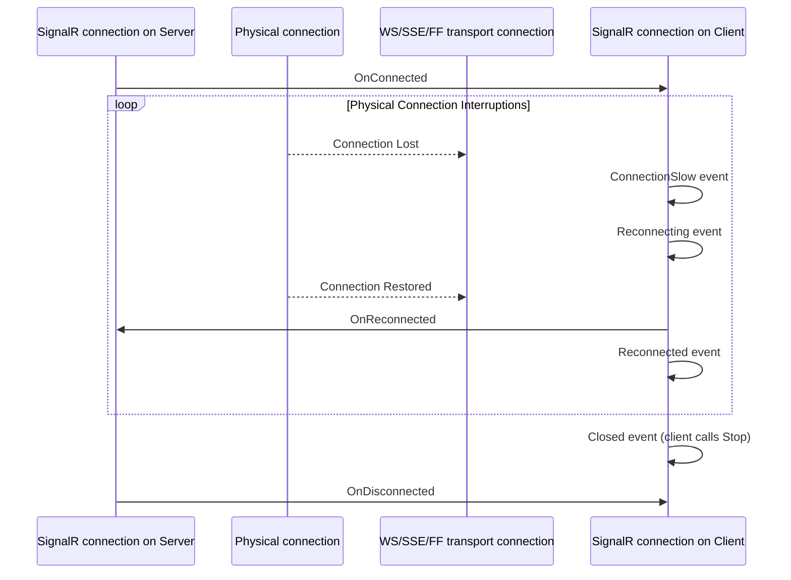

### Understanding SignalR Connections, Transport Connections, and Physical Connections

In the world of SignalR, connections are categorized into three types: SignalR connections, transport connections, and physical connections. Here's a brief overview of each:

1. **SignalR Connection**: This is a logical relationship between a client and a server URL, managed by the SignalR API and identified by a unique connection ID. It persists until the client calls the `Stop` method or a timeout occurs while trying to re-establish a lost transport connection.

2. **Transport Connection**: This is a logical relationship between a client and a server, maintained by one of the four transport APIs: WebSockets, server-sent events, forever frame, or long polling. It relies on a physical network connection and ends when SignalR terminates it or the transport API detects a broken physical connection.

3. **Physical Connection**: This refers to the actual network links (wires, wireless signals, routers, etc.) that enable communication between a client and a server. A physical connection is necessary to establish a transport connection, which in turn is required to establish a SignalR connection. However, breaking the physical connection doesn't always immediately end the transport or SignalR connection.

When a SignalR client calls the `Start` method, it provides the necessary information to establish a physical connection to a server. If the transport connection fails, the SignalR connection remains because the client can automatically re-establish a new transport connection using the same SignalR URL without user intervention. The connection ID remains unchanged, reflecting the continuity of the SignalR connection.

Some digrams explaining the connection behavior

This diagram illustrates the relationships between the different types of connections in SignalR, showing how they depend on each other and are managed by different APIs.

