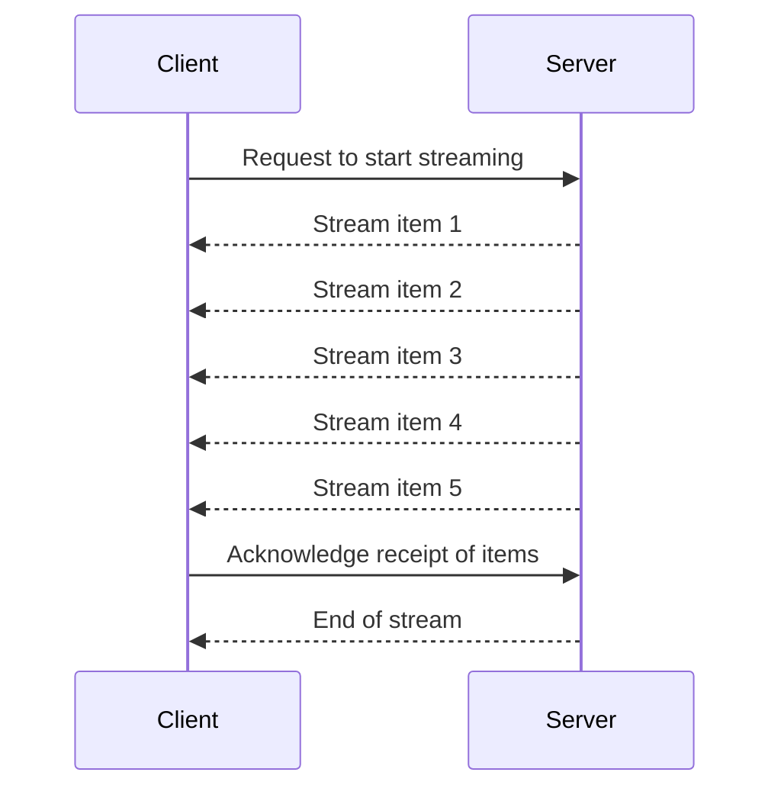

# Streaming using SignalR

ASP.NET Core SignalR enables streaming between client and server, which is beneficial for handling data that arrives in fragments over time. Instead of waiting for the complete data set, each fragment is transmitted immediately as it becomes available.

## How Streaming Works

A hub method automatically becomes a streaming hub method when it returns `IAsyncEnumerable<T>`, `ChannelReader<T>`, `Task<IAsyncEnumerable<T>>`, or `Task<ChannelReader<T>>`.

### Example using `IAsyncEnumerable<T>`

In this example, we will create a SignalR hub that streams a sequence of numbers to the client.

#### Hub Implementation

```csharp
using System.Runtime.CompilerServices;
using Microsoft.AspNetCore.SignalR;

namespace StreamingBasics.Hubs
{
    public class AsyncEnumerableHub : Hub
    {
        public async IAsyncEnumerable<int> GetNumbers(int count, int delay, [EnumeratorCancellation]CancellationToken cancellationToken)
        {
            for(var i = 0; i<count; i++)
            {
                cancellationToken.ThrowIfCancellationRequested();
                yield return i;
                await Task.Delay(delay, cancellationToken);
            }
        }
    }
}
```

#### Client Implementation

```csharp
using Microsoft.AspNetCore.SignalR.Client;
using Microsoft.Extensions.Logging;

namespace StreamingClient
{
    internal class Program
    {
        static async Task Main(string[] args)
        {
            HubConnection connection = new HubConnectionBuilder()
                .WithUrl("https://localhost:7127/nstream", options =>
                {
                    options.Transports = HttpTransportType.WebSockets | HttpTransportType.ServerSentEvents;
                })
                .ConfigureLogging(logging =>
                {
                    logging.AddConsole();
                    logging.SetMinimumLevel(LogLevel.Debug);
                })
                .Build();

            try
            {
                await connection.StartAsync();
                Console.WriteLine("Connection started successfully.");
                var cancellationTokenSource = new CancellationTokenSource();

                var stream = connection.StreamAsync<int>("GetNumbers", 10, 5000, cancellationTokenSource.Token);

                await foreach (var count in stream)
                {
                    Console.WriteLine($"{count}");
                }

                Console.WriteLine("Streaming completed");
            }
            catch (Exception ex)
            {
                Console.WriteLine($"Error: {ex.Message}");
            }

            Console.ReadLine();
        }
    }
}
```

### Mermaid Diagram

The following mermaid diagram illustrates the streaming process between the client and the server:



In this diagram, the client sends a request to the server to start streaming. The server then sends each item in the stream to the client as it becomes available. The client acknowledges the receipt of the items, and the server indicates the end of the stream once all items have been sent.

## Conclusion

SignalR streaming using `IAsyncEnumerable<T>` is a powerful feature that allows for efficient real-time data transfer between the client and server. By leveraging this feature, you can build responsive applications that handle data in a more granular and efficient manner.


