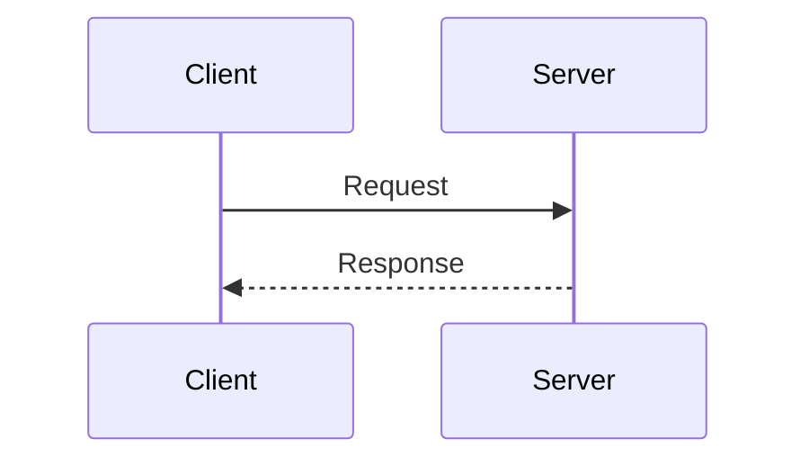
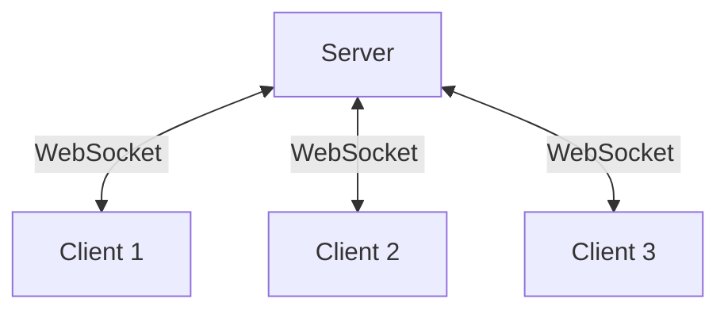

What are the supported transporting protocols ?

1. Websockets
2. SSE
3. Longpolling 

Traditional HTTP

```mermaid
sequenceDiagram
    participant Client
    participant Server

    Client->>Server: Request
    Server-->>Client: Response
```

Websockets 

```mermaid

    flowchart TD
    n1["Server"] <-- "<span style=color:>WebSocket&nbsp;</span>" --> n2["Client 1"]
    n1 <-- "<span style=background-color:>WebSocket</span><span style=background-color:>&nbsp;</span>" --> n4["Client 2"] & n3["Client 3"]

    n1@{ shape: rect}
    n2@{ shape: rect}
    n4@{ shape: rect}
    n3@{ shape: rect}


```

SSE - Server-sent events 

Client - Server 

Long polling 

