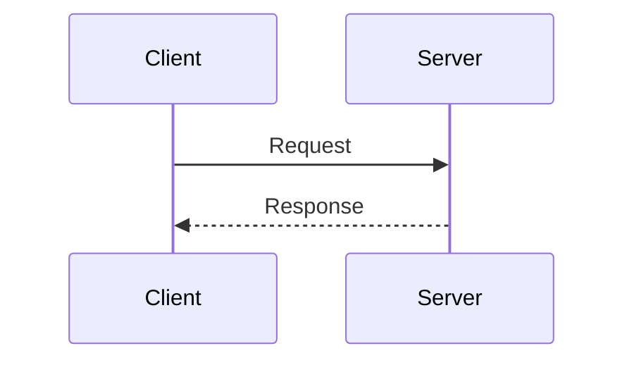
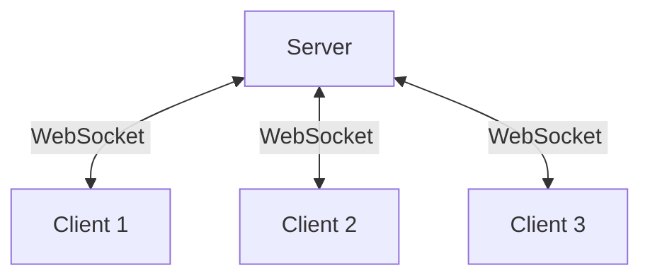
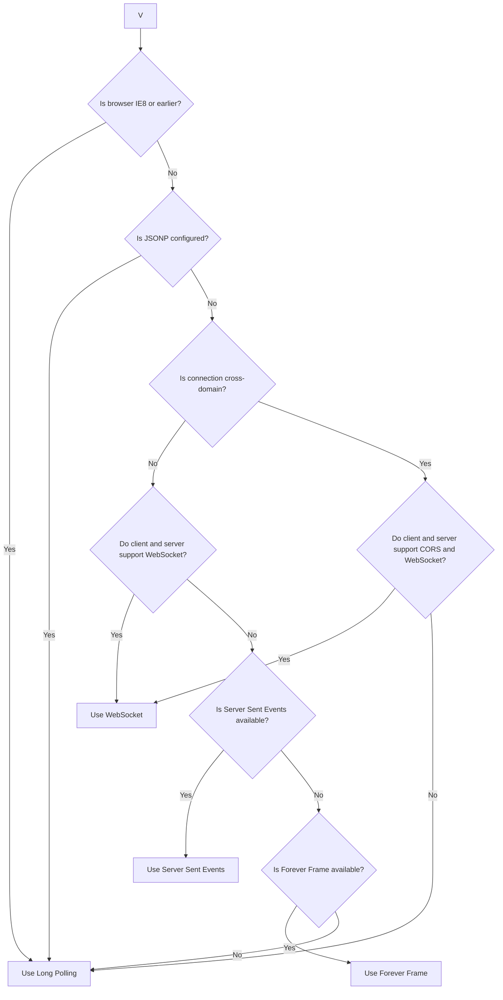

# Supported transport types 

SignalR is an abstraction over some of the transports that are required to do real-time work between client and server

HTML 5 transports depend on browser support. If unsupported, older transports are used. WebSocket provides a persistent, two-way connection but requires modern browsers. Server Sent Events (EventSource) are supported by most browsers except Internet Explorer. Comet transports include Forever Frame (Internet Explorer only) and Ajax long polling, which maintains a long-held HTTP request for server push data.

1. WebSockets
2. SSE (Server sent events)
3. Long Polling 

SignalR by default uses WebSocket transport and it falls back to older transports mechanisms when WebSocket is not supported or if older transports are preferred.

### Traditional HTTP

We know about basic HTTP request response model. 

---

### Websockets 

WebSocket establishes persistent, two way connection between client and server. 

---

SSE - Server-sent events 

    Also known as EventSource

    Forever Frames

Long polling 

---
Transportation selection steps followed by signalR 

A flowchart to support explaining this selection process. 

---