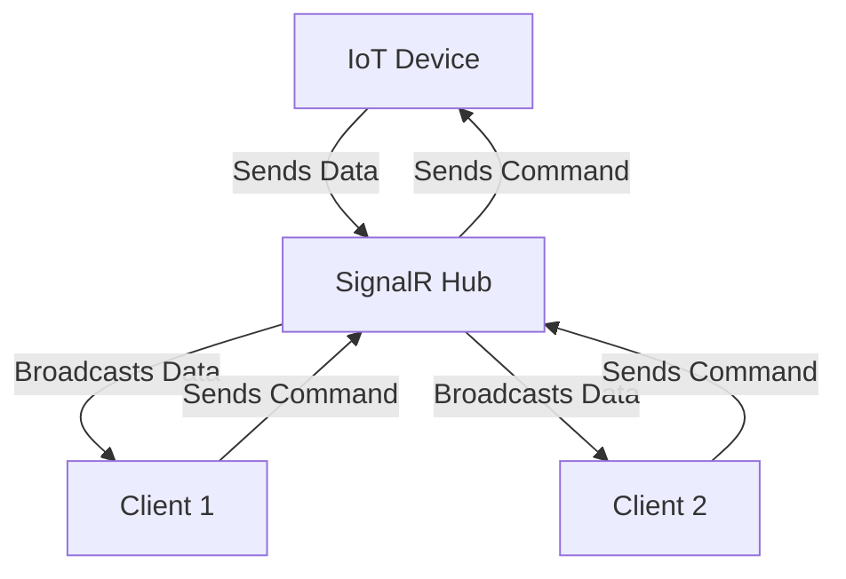

## Introduction

### What is SignalR ?

```mermaid
graph TD
    A[IoT Device] -- Sends Data --> B[SignalR Hub]
    B -- Broadcasts Data --> C[Client 1]
    B -- Broadcasts Data --> D[Client 2]
    C -- Sends Command --> B
    D -- Sends Command --> B
    B -- Sends Command --> A
```
