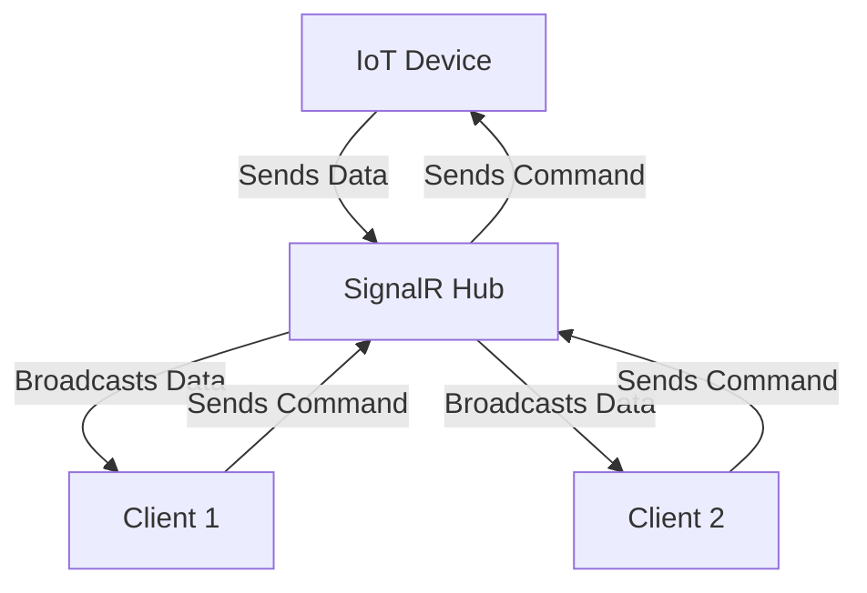

## Introduction

---

**SignalR** is a library for building real-time web applications. It allows for two-way communication between clients (like web browsers) and servers, meaning that both can send and receive messages instantly. Here’s a simpler breakdown of SignalR:

**Real-time Communication**: Imagine you are in a chat room. When someone sends a message, everyone in the room sees it immediately. SignalR makes this possible for web applications.

**Push Notifications**: Instead of a web page constantly checking (or polling) for new information, SignalR pushes updates to clients whenever there is new data. This is more efficient and responsive.

**Versatile Transport**: SignalR automatically chooses the best way to transmit messages. It can use WebSockets if available, which is a fast communication protocol, or fall back to other methods like Server-Sent Events or long polling if necessary.

**Connection Management**: SignalR handles connection issues smoothly. If a client gets disconnected (like losing Wi-Fi), SignalR will attempt to reconnect automatically without disturbing the user experience.

**Scalability**: It can be used for large applications. SignalR supports scaling out to multiple servers, managing users effectively even in a high-traffic environment.